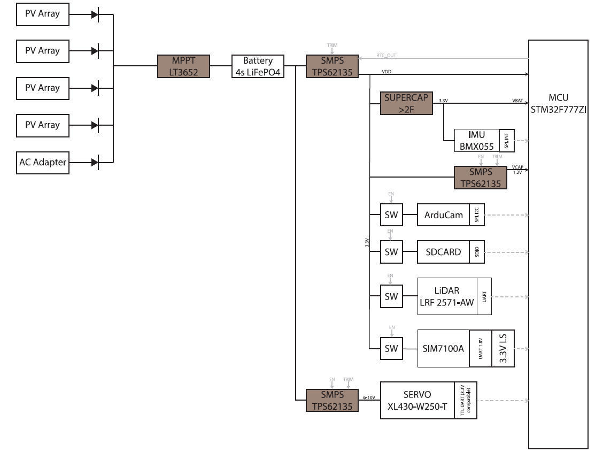
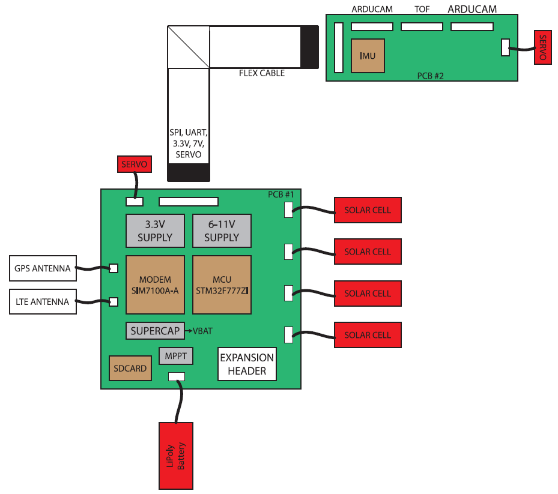
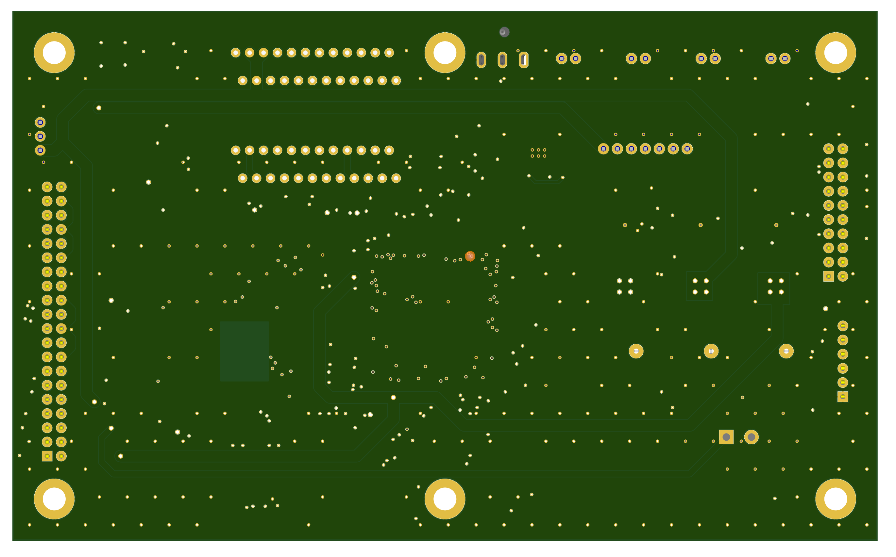
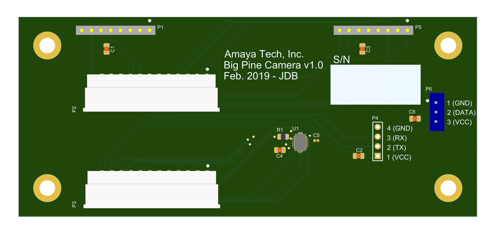
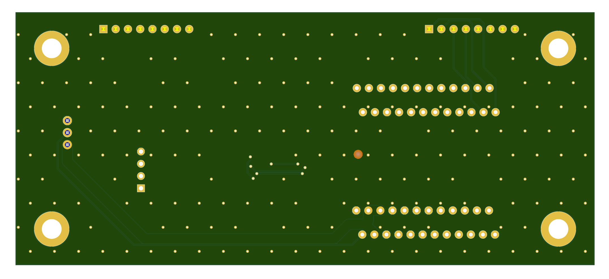

# Bigpine Remote Camera

Bigpine is an embedded STM32F7 microcontroller based remote camera. It uses Arducam and a SIM7100A modem for streaming photos back to a server. It runs on batteries or solar panels and has a peak-power. Bigpine is designed to snap and upload 24 photos per day and last for 3 years on a 100W-hr primary cell battery. Of course this can be tweaked for your application. Something ridiculous like 10,000 photos a day is probably doable, but you'll have to do your own power budget. Remember, this runs on a microcontroller.

## Architecture

Block diagram:

The hardware is all about low power. To reduce quiescent power between images the mainboard contains a supercap to run the MCU sleep timers. During sleep all switching regulars may be shut down. The supercap also runs the IMU so the device may be awoken with a motion interrupt.

As you'll see there is also support for two servos for pan/tilt capability, and another UART/power interface designated for a LIDAR module, although really anything could be connected.

The onboard SD card may be used for caching photos to reduce the amount of modem ON time. The modem is very power hungry and it has a substantial bootup time, so in many applications its best to use the modem only several times a day.

The ArduCam is a simple modular low-frame rate commercial camera. It's not super cheap, and not super good quality, but it's very easy to use.

## Hardware

The hardware consists of two boards, the camera board, and the main board. The boards connect together using FPC cables.

### Main board

PDF schematics can be found [here](main_board_schematics_.pdf).

### Camera board

PDF schematics can be found [here](camera_board_schematics.pdf).

## Firmware

Don't plan on getting much usefulness from this code. Only a proof of concept has been included. Power management has not been included. Features available are ArduCam control and capture, and SIM7100A modem control and upload. There are several good libraries for control of all the peripherals, but the point of this firmware was to prove out the hardware.

**The pin mapping is currently configured for an old evaluation board. It won't do you any good. Be sure to change the pin mapping for the PCB.**

## Conclusion

With a bit of work this can be a low-cost, web connected, remote telemetry system. I believe the schematics and pcb routing are in good shape and ready to fab, but **it has not yet been manufactured! So use at your own risk!** A functional prototype was built using the STM32F7 nucleo dev board. But expect there to be some amount of bring-up work on this project.
